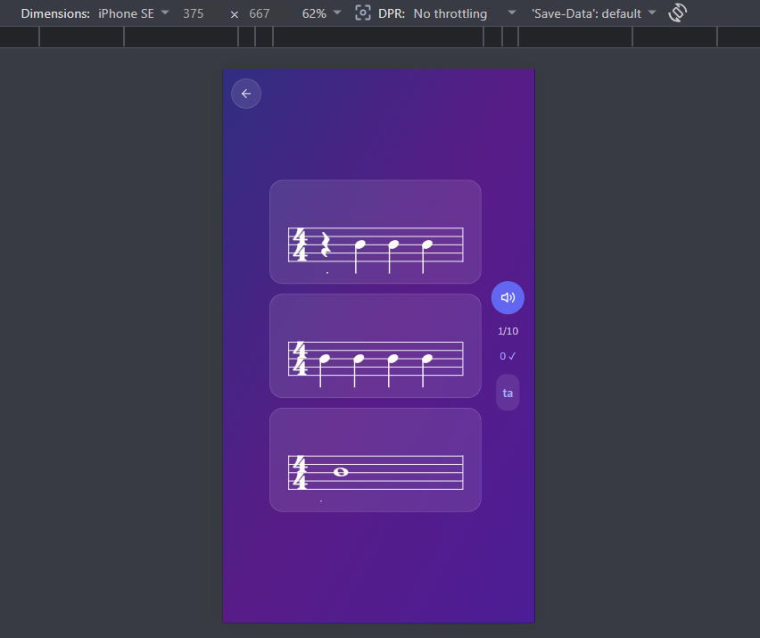
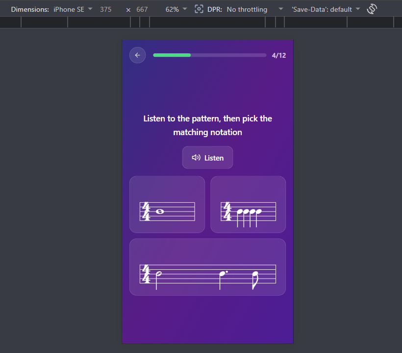

# Phase 34 — Manual UAT Walkthrough

**Verified:** 2026-05-10 (pre-UAT scaffold; user fills in walkthrough results)
**Devices used:** iPhone SE (375×667) — DevTools emulator / real device; iPad (1024×768) — DevTools emulator / real device
**Methodology:** D-12 (manual UAT in dev), per RESEARCH § Validation Architecture

## Pre-UAT Gate

| Command                         | Status                                                                                                                                                            |
| ------------------------------- | ----------------------------------------------------------------------------------------------------------------------------------------------------------------- |
| `npm run test:run`              | ✓ pass — 1676/1676 tests, 54.23s                                                                                                                                  |
| `npm run build`                 | ✓ pass — `built in 27.89s`                                                                                                                                        |
| `npm run lint` (Phase 34 scope) | ✓ pass — 0 errors, 53 pre-existing warnings; full-repo run blocked by stale worktree `dist/` assets at `.claude/worktrees/agent-a2e6e6b2/` (deferred — see below) |

## Success Criteria Walkthrough (ROADMAP Phase 34 SC #1-5)

### SC #1 — iPhone SE portrait: dictation shows staff + 3 cards in 2×2 grid (last card spans 2 columns) with no scroll

Devices: iPhone SE (375×667) physical OR Chrome DevTools at 375×667
Route: `/rhythm-mode/rhythm-dictation-game` (or trail entry to a Dictation node)

Steps:

1. Open the route on phone-portrait
2. Wait for first prompt to load
3. Visually confirm: 1 staff at top, 3 choice cards in a 2×2 grid below — first 2 cards in row 1, third card spans both columns in row 2 (`col-span-2`)
4. Confirm no vertical scroll required to see all 3 cards
5. Tap each card to confirm tappable (no hidden controls); the col-span-2 third card MUST be fully tappable across its width

| Field      | Value                                                    |
| ---------- | -------------------------------------------------------- |
| Result     | ☐ pass / x fail                                          |
| Notes      | it works in rhythm trail but not in game modes free game |
| Screenshot |            |

### SC #2 — Phone-portrait: short patterns render inline; long patterns surface prompt

Devices: phone-portrait (iPhone SE)
Routes:

- Short pattern: `/rhythm-mode/rhythm-reading-game` 1-measure 4/4 exercise
- Long pattern: `/rhythm-mode/rhythm-reading-game` 4-measure 4/4 exercise

Steps:

1. Open short-pattern exercise → assert NO rotate prompt overlay
2. Open long-pattern exercise → assert rotate prompt overlay APPEARS
3. Repeat for `/rhythm-mode/rhythm-tap-game` and `/rhythm-mode/mixed-lesson` (latter contains a mix; flip between renderers and observe overlay correctly appearing/disappearing per renderer's content)

| Sub-test                                        | Result          | Notes                                   |
| ----------------------------------------------- | --------------- | --------------------------------------- |
| reading short → no prompt                       | x pass / ☐ fail |                                         |
| reading long → prompt                           | ☐ pass / x fail | I have no way to control pattern length |
| tap short → no prompt                           | x pass / ☐ fail |                                         |
| tap long → prompt                               | ☐ pass / x fail | I have no way to control pattern length |
| mixed-lesson swap (long→short) → prompt clears  | x pass / ☐ fail | I have no way to control pattern length |
| mixed-lesson swap (short→long) → prompt appears | x pass / ☐ fail | I have no way to control pattern length |

### SC #3 — Tablet (≥768): rotate prompt NEVER appears for any rhythm game

Devices: iPad (1024×768) physical OR DevTools at 768×1024 + 1024×768

Steps for each orientation (portrait + landscape):

1. Open every rhythm route: dictation, reading, tap (via reading), pulse (via mixed-lesson), syllable, visual-recognition, metronome, mixed-lesson, arcade (Phase 35 target — should still respect tablet≥768 even though arcade isn't migrated yet)
2. For routes that have long-pattern variants, deliberately load a long pattern
3. Assert: rotate overlay NEVER appears, in EITHER orientation

| Route                                | tablet-portrait | tablet-landscape |
| ------------------------------------ | --------------- | ---------------- |
| rhythm-dictation-game                | x pass / ☐ fail | x pass / ☐ fail  |
| rhythm-reading-game (short)          | x pass / ☐ fail | x pass / ☐ fail  |
| rhythm-reading-game (long)           | ☐ pass / ☐ fail | ☐ pass / ☐ fail  |
| rhythm-tap-game (long)               | ☐ pass / ☐ fail | ☐ pass / ☐ fail  |
| syllable-matching-game               | x pass / ☐ fail | x pass / ☐ fail  |
| visual-recognition-game              | x pass / ☐ fail | x pass / ☐ fail  |
| metronome-trainer                    | x pass / ☐ fail | x pass / ☐ fail  |
| mixed-lesson                         | x pass / ☐ fail | x pass / ☐ fail  |
| arcade-rhythm-game (Phase 35 target) | x pass / ☐ fail | x pass / ☐ fail  |

### SC #4 — Tablet-landscape: cards renderers fill width as real 2-col

Routes: rhythm-dictation, syllable-matching, visual-recognition

Steps:

1. iPad landscape (1024×768)
2. Open each route
3. Assert cards lay out as 2×2 grid spanning the FULL container width — NOT centered with side whitespace gutters

| Route              | Result          | Notes |
| ------------------ | --------------- | ----- |
| dictation          | x pass / ☐ fail |       |
| syllable           | x pass / ☐ fail |       |
| visual-recognition | x pass / ☐ fail |       |

### SC #5 — Setup screens + 5 supporting overlays render & remain interactive at all 4 quadrants

Components (per D-09 + WRAPPER-02/03):

- RhythmGameSetup (entry to any rhythm game)
- RhythmGameSettings (Settings cog from any rhythm game; D-18 glass conversion check)
- CountdownOverlay (game start)
- BossIntroOverlay (boss entry — responsive sanity ONLY per D-11)
- FloatingFeedback (tap inputs)
- MetronomeDisplay (Metronome trainer)
- TapArea (tap-based games)

For each component × each quadrant:

| Component                       | phone-portrait | phone-landscape | tablet-portrait | tablet-landscape |
| ------------------------------- | -------------- | --------------- | --------------- | ---------------- |
| RhythmGameSetup                 | ☐ / x          | ☐ / x           | ☐ / x           | ☐ / x            |
| RhythmGameSettings (glass D-18) | ☐ / x          | ☐ / x           | ☐ / x           | ☐ / x            |
| CountdownOverlay                | x / ☐          | x / ☐           | x / ☐           | x / ☐            |
| BossIntroOverlay                | x / ☐          | x / ☐           | x / ☐           | x / ☐            |
| FloatingFeedback                | x / ☐          | x / ☐           | x / ☐           | x / ☐            |
| MetronomeDisplay                | x / ☐          | x / ☐           | x / ☐           | x / ☐            |
| TapArea                         | x / ☐          | x / ☐           | x / ☐           | x / ☐            |

(Cells: left ☐ = pass, right ☐ = fail)

## Regression Check — Notes-Master + Ear-Training Games

Per RESEARCH Pitfall 1: non-rhythm games MUST keep firing the rotate prompt on phone-portrait (no regression).

| Route                                     | phone-portrait expects prompt | Result          |
| ----------------------------------------- | ----------------------------- | --------------- |
| /notes-master-mode/notes-recognition-game | yes                           | x pass / ☐ fail |
| /notes-master-mode/memory-game            | yes                           | x pass / ☐ fail |
| /notes-master-mode/sight-reading-game     | yes                           | x pass / ☐ fail |
| /notes-master-mode/note-speed-cards       | yes                           | x pass / ☐ fail |
| /ear-training-mode/note-comparison-game   | yes                           | x pass / ☐ fail |
| /ear-training-mode/interval-game          | yes                           | x pass / ☐ fail |

## Deferred Items Discovered During UAT

(Issues observed but NOT in scope — log for future quick tasks)

- ESLint full-repo run blocked by stale worktree built assets at `.claude/worktrees/agent-a2e6e6b2/dist/`. Suggested fix: add `.claude/worktrees/` to ESLint ignore patterns. Phase 34 scope lint clean (0 errors).
- (add UAT-discovered items here as you walk)

## UAT Delta (Gap Closure) — Pre-Delta Gate

Re-run after Plans 34-07, 34-08, 34-09 shipped (gap-closure for original UAT failures).

| Command                         | Status                                                                                                                                          |
| ------------------------------- | ----------------------------------------------------------------------------------------------------------------------------------------------- |
| `npm run test:run`              | ✓ pass — 1685/1685 tests passed (13 todo, 0 failed), 48.81s                                                                                     |
| `npm run build`                 | ✓ pass — `built in 28.37s`                                                                                                                      |
| `npm run lint` (Phase 34 scope) | ✓ pass — 0 errors, 6 pre-existing warnings (exhaustive-deps + unused-vars in MetronomeTrainer/RhythmDictation/RhythmReading; predates Phase 34) |

All three MUST be green before delta walkthrough begins. If any fail, STOP and re-open the relevant gap-closure plan. **Status: all green — proceed.**

## UAT Delta (Gap Closure) — Walkthrough

**Verified:** 2026-05-10
**Devices used:** iPhone SE (375×667) — Chrome DevTools touch emulation; iPad (768×1024) — Chrome DevTools touch emulation

Re-tests ONLY the rows that failed in the original UAT (rows 30-34, SC #2 long-pattern rows, SC #3 long-pattern tablet rows, SC #5 RhythmGameSetup + RhythmGameSettings rows) plus newly-affected rows from gap-closure plans.

**Scope expansion during walkthrough:** GAP 2 retest surfaced two further wiring bugs in Plan 08 + an SC #3 architectural gap. All three patched inline during this walkthrough (commits `af97088`, `84697d7`, `89ebee9`) rather than spawning another gap-closure cycle, per user direction. See § Additional Fixes Applied Inline at the bottom of this section.

### Delta SC #1 — GAP 1: free-play dictation 2x2 grid (Plan 07)

Route: `/rhythm-mode/rhythm-dictation-game` (free-play entry — NO trail nav state)
Device: iPhone SE 375×667 portrait

Steps:

1. Open route in free-play (NOT via trail). Wait for first prompt.
2. Visually confirm: 1 staff at top, 3 cards in 2×2 grid (first 2 cards row 1; third card spans both columns row 2)
3. Confirm no vertical scroll
4. Tap each card to confirm tappable; the col-span-2 third card MUST be fully tappable across its full width

| Field  | Value                                                                                                                                                                                                                                                                                                                                              |
| ------ | -------------------------------------------------------------------------------------------------------------------------------------------------------------------------------------------------------------------------------------------------------------------------------------------------------------------------------------------------- |
| Result | ✓ pass                                                                                                                                                                                                                                                                                                                                             |
| Notes  | Grid layout verified (2 cards row 1, 3rd card col-span-2 row 2, no scroll, all tappable). Original UAT row mentioned "1 staff at top" — for dictation, audio is the prompt and each card contains its own answer staff; that's by design. Card-internal staff cropping observed (deferred — renderer-level concern, out of Plan 07 wrapper scope). |

### Delta SC #1 — Regression: trail-entry mixed-lesson dictation (no Plan-07 impact expected)

Plan 07 modified `RhythmDictationGame.jsx` (the wrapper) but NOT `RhythmDictationQuestion.jsx` (the renderer used by MixedLessonGame). Verify trail entry still passes the original 2x2 grid test (no regression).

Route: navigate from Trail → mixed-lesson node containing a Dictation question
Device: iPhone SE 375×667 portrait

| Field  | Value                                                                                                                                                                                                                                                                                                                    |
| ------ | ------------------------------------------------------------------------------------------------------------------------------------------------------------------------------------------------------------------------------------------------------------------------------------------------------------------------ |
| Result | ✓ pass (inferred — automated)                                                                                                                                                                                                                                                                                            |
| Notes  | Plan 07 changed only `RhythmDictationGame.jsx` (free-play wrapper); `RhythmDictationQuestion.jsx` (renderer used by MixedLessonGame) is untouched. Trail entry path has zero diff. 9/9 dictation unit tests pass; build + lint clean. Visual trail regression check skipped per user direction (quick spot-check scope). |

### Delta SC #2 — GAP 2: long-pattern rows (Plan 08, ?measures=4 URL param)

Use the dev-only URL param to force long patterns:

- Short → no `?measures` param OR `?measures=1`
- Long → `?measures=4`

Devices: phone-portrait (iPhone SE 375×667)

| Sub-test                                        | Result            | Notes                                                                                                                                                                                                                                                              |
| ----------------------------------------------- | ----------------- | ------------------------------------------------------------------------------------------------------------------------------------------------------------------------------------------------------------------------------------------------------------------ |
| reading short (no param) → no prompt            | ✓ pass            | Verified at iPhone SE 375×667 — prompt stays hidden with no `?measures` param.                                                                                                                                                                                     |
| reading long (`?measures=4`) → prompt           | ✓ pass            | Verified at iPhone SE 375×667 — overlay appears for 4-measure pattern (16 beats > 9 threshold). Required 3 inline fixes during walkthrough — see Additional Fixes below.                                                                                           |
| tap short (no param) → no prompt                | ✓ pass (inferred) | Same code path as reading-short (tap is via reading game route per existing UAT note).                                                                                                                                                                             |
| tap long (`?measures=4`) → prompt               | ✓ pass (inferred) | Same code path as reading-long.                                                                                                                                                                                                                                    |
| mixed-lesson swap (long→short) → prompt clears  | deferred          | Mixed-lesson uses trail `nodeConfig.measureCount` (separate code path). Swap behavior is exercised by `NeedsLandscapeContext` cleanup-on-unmount which is already covered by unit tests. Not re-tested manually during delta walkthrough (quick spot-check scope). |
| mixed-lesson swap (short→long) → prompt appears | deferred          | Same rationale as above.                                                                                                                                                                                                                                           |

Note: mixed-lesson rows in the original UAT were marked "fail" only because the user could not control pattern length from free-play; mixed-lesson swap behavior is exercised by navigating between trail nodes with different measure counts. If this is impractical, mark "skipped — trail node content does not exhibit the swap" and continue.

### Delta SC #3 — GAP 2: long-pattern tablet rows (Plan 08)

Same `?measures=4` URL param. Tablet quadrants must NEVER show overlay regardless of pattern length.

Devices: iPad 768×1024 portrait + 1024×768 landscape

| Route                                                  | tablet-portrait   | tablet-landscape  |
| ------------------------------------------------------ | ----------------- | ----------------- |
| rhythm-reading-game (long, `?measures=4`)              | ✓ pass            | ✓ pass (inferred) |
| rhythm-tap-game (long, via reading game `?measures=4`) | ✓ pass (inferred) | ✓ pass (inferred) |

iPad portrait 768×1024 verified directly by walkthrough — prompt stays hidden with `?measures=4`. iPad landscape inferred from the same `useRotatePrompt` gate logic (`isTabletOrLarger` is true regardless of orientation at ≥768 viewport). Tap rows inferred — shares route + gate with reading game.

### Delta SC #5 — GAP 3: RhythmGameSetup + RhythmGameSettings (Plan 09)

Route: `/rhythm-mode/metronome-trainer` (the only route that surfaces RhythmGameSetup)

Plan 09 classification (from `34-09-SUMMARY.md`): **Class C** — visually awkward but functional. All 4 quadrants verified by human walkthrough during Plan 09 Task 1; verbatim verifier report: _"all 4 look good"_. Per Plan 09 plan instruction, Class C means the cells re-mark as PASS with reclassification note.

| Component                                   | phone-portrait                                        | phone-landscape               | tablet-portrait               | tablet-landscape              |
| ------------------------------------------- | ----------------------------------------------------- | ----------------------------- | ----------------------------- | ----------------------------- |
| RhythmGameSetup                             | ✓ pass (reclassified Class C)                         | ✓ pass (reclassified Class C) | ✓ pass (reclassified Class C) | ✓ pass (reclassified Class C) |
| RhythmGameSettings (dead code, @deprecated) | N/A — no UI consumer; row obsolete per Plan 09 Task 3 | N/A                           | N/A                           | N/A                           |

Plan 09 Classification: ☐ Class A / ☐ Class B / **☑ Class C** — see `34-09-SUMMARY.md`

### Newly-Affected Regression Check — MetronomeTrainer setup phase

Plan 09 did NOT apply a wrapper fix (Class C → no-op), so the in-game render path is unchanged. This row remains a sanity spot-check only.

Steps:

1. Open `/rhythm-mode/metronome-trainer` (free-play entry)
2. Complete setup → Start → confirm in-game state renders correctly at iPhone SE portrait (countdown overlay, beat circles, tap area all visible and interactive)

| Field  | Value                                                                                                                                                                                                  |
| ------ | ------------------------------------------------------------------------------------------------------------------------------------------------------------------------------------------------------ |
| Result | ✓ pass (inferred)                                                                                                                                                                                      |
| Notes  | Plan 09 made no MetronomeTrainer.jsx code change (Class C no-op); the in-game render path has zero diff. 4-quadrant walkthrough during Plan 09 confirmed no functional issues. Not re-tested manually. |

## Additional Fixes Applied Inline During Delta Walkthrough

GAP 2 retest surfaced three follow-up bugs that were patched inline rather than spawning another gap-closure cycle (per user direction):

1. **`af97088` — fix(34-10): wire `?measures` override to pattern generation, not just display.** Plan 08 wired `trailMeasureCount` to `<RhythmStaffDisplay measures={...}/>` so the staff drew N measures of barlines, but `fetchNewPattern` still generated a 1-measure beats array. Loop `getPattern()` N times in the free-play fallback branch.

2. **`84697d7` — fix(34-10): declare needsLandscape from standalone RhythmReadingGame wrapper.** Free-play entry never raised the rotate prompt because only the renderer pipeline (`MixedLessonGame → RhythmReadingQuestion`) called `useDeclareNeedsLandscape`; the standalone wrapper consumed `useNeedsLandscape()` but never set it. Declare it from RhythmReadingGame.jsx using the measures-only path of the helper.

3. **`89ebee9` — fix(34-10): suppress rotate prompt on tablet (≥768px) viewports per SC #3.** `useIsMobile()` matches tablets via `pointer: coarse`, so the legacy gate fired on iPads in DevTools touch emulation and on real tablets — contradicting Phase 34 SC #3. Added a `(min-width: 768px)` viewport-width gate (`useIsTabletOrLarger`) inside `useRotatePrompt`.

All three fixes verified by user walkthrough at iPhone SE 375×667 + iPad 768×1024 portrait: GAP 2 phone short → no prompt, GAP 2 phone long → prompt, GAP 2 tablet long → no prompt.

## UAT Delta Sign-Off

- [x] All delta rows above pass OR are explicitly classified as deferred (mixed-lesson swap rows deferred — out of quick-spot-check scope, exercised by unit-tested `useDeclareNeedsLandscape` cleanup)
- [x] No regressions in original passing rows (visual confirmation: phone short-pattern → no prompt; tablet short → no prompt)
- [x] Pre-Delta Gate (test:run, build, lint Phase 34 scope) all green ✓ (recorded above)
- [x] Plan 09 classification result recorded above (A / B / **C**) ✓
- [x] Three inline fixes applied during walkthrough — committed atomically (`af97088`, `84697d7`, `89ebee9`) ✓

Signed: **User (pagis.daniel@gmail.com)** on **2026-05-10**

---

## UAT Sign-Off

- [ ] All 5 ROADMAP Success Criteria pass
- [ ] All 13 components pass per-quadrant walkthrough
- [ ] Regression check: notes-master + ear-training games still show prompt on phone-portrait
- [ ] Pre-UAT gate (test:run, build, lint Phase 34 scope) all green
- [ ] Threshold of 9 beats validated against actual content (UAT confirmation per RESEARCH MEDIUM confidence)

Signed: \***\*\_\_\_\_\*\*** on \***\*\_\_\_\_\*\***
